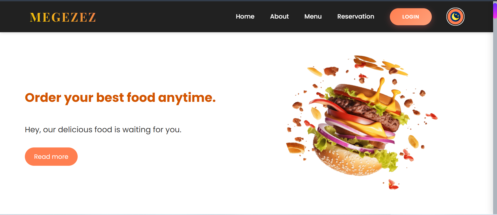
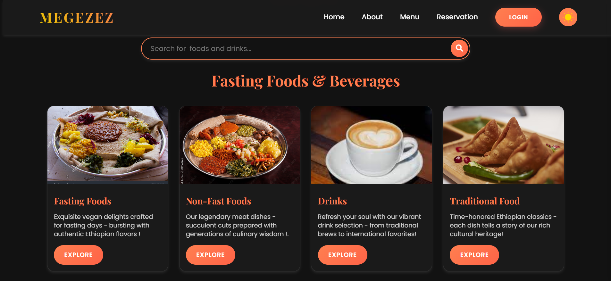
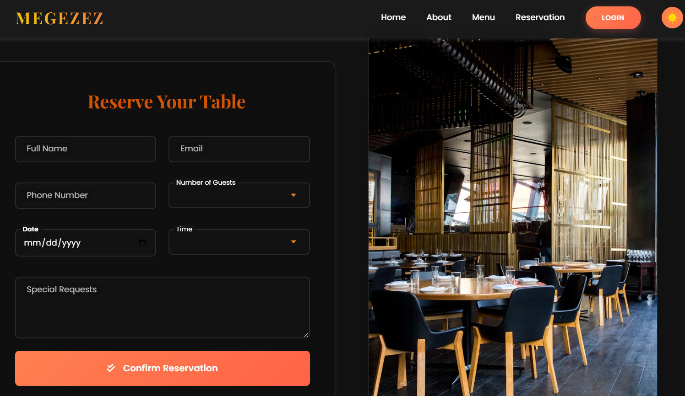

# 🍽️ MEGEZEZ Restaurant Website


**MEGEZEZ Restaurant** is a modern, responsive restaurant website built for **Debre Berhan University (DBU)** students and teachers.  
It offers an elegant dining experience both online and offline — users can explore menus, book tables, and contact the restaurant easily.

---

## 🌐 Live Demo

🔗 **[View Website](https://megezez-resturant.vercel.app/)**  


---

## 🏫 About the Project

MEGEZEZ Restaurant is located inside **Debre Berhan University (DBU)** and provides quality food and a comfortable environment for students and staff.  
This website is designed to simplify customer interaction and highlight the restaurant’s services digitally.

---

## ✨ Features

✅ Fully responsive design (mobile-first)  
✅ Elegant UI built with pure **HTML, CSS, and JavaScript**  
✅ Food menu with images and prices  
✅ Online table booking page  
✅ Interactive contact form  
✅ Add-to-cart and order preview (optional)  
✅ Google Fonts & Font Awesome integration  
✅ Meta tags for SEO & social sharing  

---

## 🖼️ Preview

| Home Page | Menu Page | Booking Page |
|------------|------------|--------------|
|  |  |  |


## 🛠️ Tech Stack

| Technology | Description |
|-------------|-------------|
| **HTML5** | Semantic, accessible structure |
| **CSS3** | Custom styling & animations |
| **JavaScript (ES6)** | Interactivity and dynamic content |
| **Font Awesome** | Icons |
| **Google Fonts** | Typography |
| **GitHub Pages / Vercel** | Deployment |

---

## 🚀 How to Run Locally

1. Clone this repository:
   ```bash
   git clone https://github.com/Altaseb-Chernet/Restaurant-Website.git

  

⭐ **If you like this project, don’t forget to give it a star on GitHub!** ⭐

👉 Click the ⭐ button at the top-right corner of this repository.

